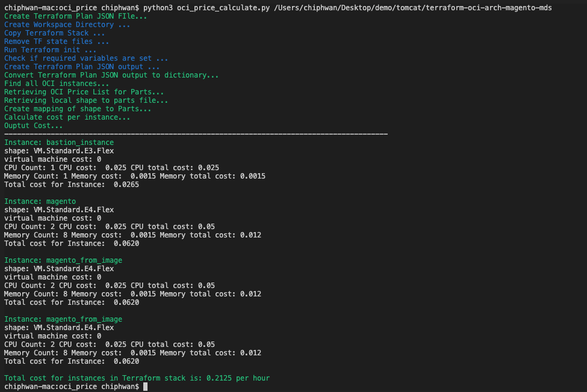

# oci instance price estimator


[](https://img.shields.io/badge/license-UPL-green) [](https://sonarcloud.io/dashboard?id=oracle-devrel_terraform-oci-arch-ci-cd)


## Introduction

This cloud estimator will show cost estimates of instances deployed using Terraform on OCI.

## Pre-requisites

- Terraform Installed
- Python 3 installed


##  Getting Started

**1. Clone or download the contents of this repo** 
    
     ```
     git clone https://github.com/chiphwang1/oci_instance_price_estimator.git
     
     ```
**2. Change to the directory that holds the Terraform code** 
     ```
     cd ./oci_instance_price_estimator
     ```
**3. Install dependencies  for the Code**

    ```
     pip install requirements.txt 
    
    ```

**4. Run oci_price_calculate.py**


``` 
oci_price_calculate.py <path to Terraform Stack>
    
```   

 ##  Sample Output



 

## License
Copyright (c) 2022 Oracle and/or its affiliates.

Licensed under the Universal Permissive License (UPL), Version 1.0.

See [LICENSE](LICENSE) for more details.